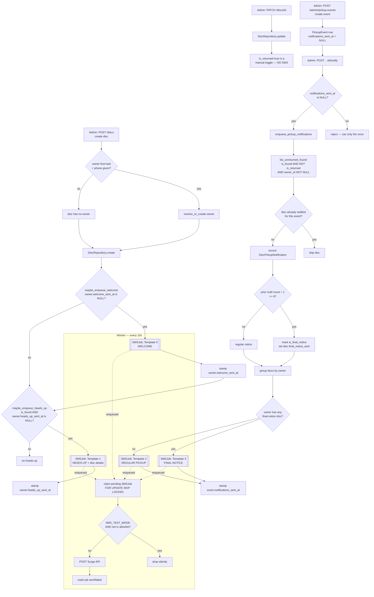

# Disc Lifecycle & SMS Flow

How discs move through the system, when return/pickup events get created, when text
messages get sent, and the exact templates for each message.

## Disc states

There is no status enum. State is two booleans on the `Disc` model
(`backend/app/models/disc.py`):

| `is_found` | `is_returned` | Meaning |
|------------|---------------|---------|
| `true`  | `false` | Active found disc, awaiting pickup |
| `true`  | `true`  | Returned / picked up by owner |
| `false` | `false` | Wishlist disc (owner wants it, not yet found) |

A disc can have `owner_id = NULL` (anonymous). Only discs with an owner are eligible
for SMS.

## SMS send points

There are exactly **three** places an SMS is enqueued:

1. **Welcome** — fired once per owner the first time their phone number is entered
   (any disc, found or wishlist). Explains the app + how to connect their number at
   discreturn.nl.
2. **Heads-up** — fired once per owner when a *found* disc with owner info is created;
   names the found disc.
3. **Pickup notification** — fired manually by an admin per pickup event; regular or
   final-notice variant.

Both write an `SMSJob` row. A background worker polls every 10s, claims pending jobs,
and sends via the **Surge** API (`backend/app/services/surge.py`). In test mode
(`SMS_TEST_MODE=true`) only numbers in `SMS_ALLOWLIST` are actually sent; others are
silently dropped.

## Flow diagram

## Key rules

- **Welcome is once per owner, ever** — gated on `owner.welcome_sent_at`, independent of
  `is_found`. Enqueued before heads-up, so a new found-disc owner gets welcome first,
  then heads-up (two texts).
- **Heads-up is once per owner, ever** — gated on `owner.heads_up_sent_at`, not per
  disc. Adding a second disc for the same owner sends no new heads-up.
- **Returning a disc sends nothing** — `is_returned=true` via PATCH is a silent admin
  toggle.
- **Notify fires once per event** — guarded by `notifications_sent_at`.
- **One SMS per owner per notify**, not per disc. All of an owner's eligible discs are
  listed in a single message.
- **Final notice** triggers when an individual disc's total notification count reaches
  `FINAL_NOTICE_THRESHOLD = 6`. If any of an owner's discs hits final, the owner gets
  the FINAL NOTICE template.

## Message templates

Variables shown as `{placeholder}`.

### Template 0 — Welcome

Source: `backend/app/services/welcome.py`

> Hi {name}, this is North Landing Disc Return — we reunite lost discs with their
> owners. To see what discs have been found and get pickup updates, go to discreturn.nl,
> sign up, and connect this phone number to your profile. This number isn't monitored
> for replies. Reply STOP to opt out.

- `{name}` = owner full name, e.g. `Jane Smith`.
- Fires for **any** new owner, including wishlist (`is_found=false`) discs.

### Template 1 — Heads-up

Source: `backend/app/services/heads_up.py`

> Hi {name}, this is North Landing Disc Return. We found one of your discs: {disc_desc}.
> Questions or comments? Email nldiscman@gmail.com. Reply STOP to opt out.

- `{name}` = owner full name, e.g. `Jane Smith`.
- `{disc_desc}` = `Manufacturer Name (Color)`, e.g. `Innova Destroyer (red)`.

### Template 2 — Regular pickup notification

Source: `backend/app/services/notification.py`

> Disc pickup at North Landing {window_str}. You have disc(s): {disc_list}. Questions or
> comments? Email nldiscman@gmail.com. Reply STOP to opt out.

### Template 3 — Final notice pickup notification

Source: `backend/app/services/notification.py`

> FINAL NOTICE: Your disc(s) [{disc_list}] will be added to the sale box if not picked
> up at the {window_str} pickup. Questions or comments? Email nldiscman@gmail.com. Reply
> STOP to opt out.

### Shared placeholders for Templates 2 & 3

- `{window_str}` — pickup window in `America/New_York`, e.g.
  `Jun 8 from 10:00 AM to 12:00 PM ET`.
- `{disc_list}` — comma-separated `Manufacturer Name (Color)`, e.g.
  `Innova Destroyer (Red), Discraft Buzzz (Blue)`.

## Inbound SMS

`POST /webhooks/sms` (`backend/app/routers/webhooks.py`) validates the Surge HMAC
signature and handles `message.received`. The body (including `STOP`) is currently
parsed and logged but **not** acted upon — opt-out is not yet wired to suppress sends.
