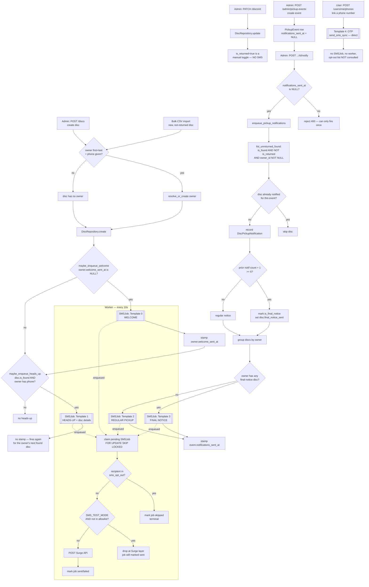

# Disc Lifecycle & SMS Flow

How discs move through the system, when return/pickup events get created, when text
messages get sent, and the exact templates for each message.

## Disc states

There is no status enum. State is two booleans on the `Disc` model
(`backend/app/models/disc.py`):

| `is_found` | `is_returned` | Meaning |
|------------|---------------|---------|
| `true`  | `false` | Active found disc, awaiting pickup |
| `true`  | `true`  | Returned / picked up by owner |
| `false` | `false` | Wishlist disc (owner wants it, not yet found) |

A disc can have `owner_id = NULL` (anonymous). Only discs with an owner are eligible
for SMS.

## SMS send points

There are **four** places an SMS originates. The first three go through the `SMSJob`
queue; the fourth bypasses it.

Queued via `SMSJob` (`PickupEventRepository.create_sms_job`):

1. **Welcome** — fired once per owner the first time their phone number is entered
   (any disc, found or wishlist). Explains the app + how to connect their number at
   discreturn.nl.
2. **Heads-up** — fired once per *found disc* that has owner info; names the found
   disc. Not deduplicated per owner — see [Key rules](#key-rules).
3. **Pickup notification** — fired manually by an admin per pickup event; regular or
   final-notice variant.

Sent directly, outside the queue:

4. **Phone verification code** — a user-initiated OTP when someone links a phone
   number to their discreturn.nl account (`backend/app/routers/users.py`
   → `send_verification_sms` in `backend/app/services/auth.py`). Runs as a FastAPI
   `BackgroundTask` calling `send_sms_sync` directly. It writes **no** `SMSJob`, is not
   handled by the worker, and is **deliberately exempt from the STOP opt-out list** —
   transactional auth is not subject to opt-out under TCPA.

Welcome and heads-up are each enqueued from **two** call sites:

- `POST /discs` (`backend/app/routers/discs.py`) — single admin disc creation.
- Bulk CSV import (`backend/app/services/disc_import.py`) — for every newly created,
  not-already-returned disc that has an owner.

A background worker (`backend/worker/main.py`) polls every 10s, claims pending jobs
with `FOR UPDATE SKIP LOCKED`, skips opted-out recipients, and sends the rest via the
**Surge** API (`backend/app/services/surge.py`). In test mode (`SMS_TEST_MODE=true`)
only numbers in `SMS_ALLOWLIST` are actually handed to Surge; others are silently
dropped at the Surge layer, but their job is still marked `sent`.

### `SMSJob` terminal statuses

| Status | Meaning |
|--------|---------|
| `sent` | Handed to Surge OK — **or** dropped by test-mode allowlist |
| `failed` | Surge call raised; error text stored on the job |
| `skipped` | Recipient was opted out at send time. Terminal — a later `START` does **not** re-queue it |

## Flow diagram


```mermaid
flowchart TD
    %% ----- Disc creation -----
    A[Admin: POST /discs<br/>create disc] --> B{owner first+last<br/>+ phone given?}
    IMP[Bulk CSV import<br/>new, not-returned disc] --> B
    B -- yes --> C[resolve_or_create owner]
    B -- no --> D[disc has no owner]
    C --> E[DiscRepository.create]
    D --> E
    E --> WEL{maybe_enqueue_welcome<br/>owner.welcome_sent_at is NULL?}
    WEL -- yes --> WG[[SMSJob: Template 0<br/>WELCOME]]
    WG --> WH[stamp owner.welcome_sent_at]
    WH --> F
    WEL -- no --> F
    F{maybe_enqueue_heads_up<br/>disc.is_found AND<br/>owner has phone?}
    F -- yes --> G[[SMSJob: Template 1<br/>HEADS-UP + disc details]]
    F -- no --> I[no heads-up]
    G --> G2[no stamp — fires again<br/>for the owner's next found disc]

    %% ----- Disc mutation -----
    M[Admin: PATCH /discs/id] --> N[DiscRepository.update]
    N --> O[is_returned=true is a<br/>manual toggle — NO SMS]

    %% ----- Pickup event + notify -----
    P[Admin: POST /admin/pickup-events<br/>create event] --> Q[PickupEvent row<br/>notifications_sent_at = NULL]
    Q --> R[Admin: POST .../id/notify]
    R --> S{notifications_sent_at<br/>is NULL?}
    S -- no --> T[reject 400 — can only fire once]
    S -- yes --> U[enqueue_pickup_notifications]
    U --> V[list_unreturned_found:<br/>is_found AND NOT is_returned<br/>AND owner_id NOT NULL]
    V --> W{disc already notified<br/>for this event?}
    W -- yes --> X[skip disc]
    W -- no --> Y[record DiscPickupNotification]
    Y --> Z{prior notif count + 1<br/>&gt;= 6?}
    Z -- yes --> AA[mark is_final_notice<br/>set disc.final_notice_sent]
    Z -- no --> AB[regular notice]
    AA --> AC[group discs by owner]
    AB --> AC
    AC --> AD{owner has any<br/>final-notice disc?}
    AD -- yes --> AE[[SMSJob: Template 3<br/>FINAL NOTICE]]
    AD -- no --> AF[[SMSJob: Template 2<br/>REGULAR PICKUP]]
    AE --> AG[stamp event.notifications_sent_at]
    AF --> AG

    %% ----- Out-of-band OTP -----
    OT[User: POST /users/me/phones<br/>link a phone number] --> OU[[Template 4: OTP<br/>send_sms_sync — direct]]
    OU --> OV[no SMSJob, no worker,<br/>opt-out list NOT consulted]

    %% ----- Worker delivery -----
    subgraph WK[Worker — every 10s]
        WG -.enqueued.-> WJ[claim pending SMSJob<br/>FOR UPDATE SKIP LOCKED]
        G -.enqueued.-> WJ
        AE -.enqueued.-> WJ
        AF -.enqueued.-> WJ
        WJ --> WO{recipient in<br/>sms_opt_out?}
        WO -- yes --> WSK[mark job skipped<br/>terminal]
        WO -- no --> WS{SMS_TEST_MODE<br/>AND not in allowlist?}
        WS -- yes --> WD[drop at Surge layer<br/>job still marked sent]
        WS -- no --> WP[POST Surge API] --> WM[mark job sent/failed]
    end
```

## Key rules

- **Welcome is once per owner, ever** — gated on `owner.welcome_sent_at`, independent of
  `is_found`. Enqueued before heads-up, so a new found-disc owner gets welcome first,
  then heads-up (two texts).
- **Heads-up is once per found disc, not once per owner** — `maybe_enqueue_heads_up`
  checks only `disc.is_found` and `owner.phone_number`. Adding a second found disc for
  the same owner sends a second heads-up. Consequence: a bulk CSV import of N found
  discs belonging to one owner enqueues N heads-up texts.
- **Returning a disc sends nothing** — `is_returned=true` via PATCH is a silent admin
  toggle.
- **Notify fires once per event** — guarded by `notifications_sent_at`; a repeat call
  returns 400.
- **One SMS per owner per notify**, not per disc. All of an owner's eligible discs are
  listed in a single message.
- **Final notice** triggers when an individual disc's total notification count reaches
  `FINAL_NOTICE_THRESHOLD = 6`. If any of an owner's discs hits final, the owner gets
  the FINAL NOTICE template.
- **STOP suppresses at send time, not enqueue time** — jobs are still created for
  opted-out owners; the worker marks them `skipped` when it picks them up.

### Known issue: `owner.heads_up_sent_at` is dead

The `heads_up_sent_at` column still exists on `Owner`, and
`OwnerRepository.mark_heads_up_sent` still exists, but **nothing in production calls
it** — only tests do. It is a leftover from when heads-up was deduplicated per owner.

This is not purely cosmetic: the CSV export in `backend/app/routers/discs.py` still
folds `owner.heads_up_sent_at` into the "Contacted" date, so that input is always NULL
and the column reflects pickup-notification dates only.

## Message templates

Variables shown as `{placeholder}`.

### Template 0 — Welcome

Source: `backend/app/services/welcome.py`

> Hi {name}, this is North Landing Disc Return — we reunite lost discs with their
> owners. To see what discs have been found and get pickup updates, go to https://discreturn.nl,
> sign up, and connect this phone number to your profile. This number isn't monitored
> for replies. Reply STOP to opt out.

- `{name}` = owner full name, e.g. `Jane Smith`.
- Fires for **any** new owner, including wishlist (`is_found=false`) discs.

### Template 1 — Heads-up

Source: `backend/app/services/heads_up.py`

> Hi {name}, this is North Landing Disc Return. We found one of your discs: {disc_desc}.
> View it and get pickup details at https://discreturn.nl. Questions or comments? Email
> nldiscman@gmail.com. Reply STOP to opt out.

- `{name}` = owner full name, e.g. `Jane Smith`; falls back to `there` if the owner has
  no name.
- `{disc_desc}` — see [Disc description format](#disc-description-format).

### Template 2 — Regular pickup notification

Source: `backend/app/services/notification.py`

> Disc pickup at North Landing {window_str}. You have disc(s): {disc_list}. Register at
> https://discreturn.nl to view the discs you have to pick up. Questions or comments? Email
> nldiscman@gmail.com. Reply STOP to opt out.

### Template 3 — Final notice pickup notification

Source: `backend/app/services/notification.py`

> FINAL NOTICE: Your disc(s) [{disc_list}] will be added to the sale box if not picked
> up at the {window_str} pickup. Register at https://discreturn.nl to view the discs you have to
> pick up. Questions or comments? Email nldiscman@gmail.com. Reply STOP to opt out.

### Shared placeholders for Templates 2 & 3

- `{window_str}` — pickup window in `America/New_York`, e.g.
  `Jun 8 from 10:00 AM to 12:00 PM ET`.
- `{disc_list}` — comma-separated disc descriptions, e.g.
  `Innova Destroyer (red), Discraft Buzzz (blue)`.

### Disc description format

Templates 1, 2 and 3 all render a disc as:

```
{manufacturer} {name} ({comma-joined colors})
```

`Disc.colors` is a Postgres `ARRAY`, so a multi-color disc renders every color:
`Innova Destroyer (red)`, `Discraft Buzzz (red, blue)`. Colors are rendered exactly as
stored — no capitalization is applied.

### Template 4 — Phone verification code

Source: `backend/app/services/auth.py`

> Your North Landing disc return verification code is: {code}

- `{code}` = 6-digit numeric code.
- Sent synchronously via `send_sms_sync` from a background task — **not** queued as an
  `SMSJob`, and **not** filtered against the opt-out list.

## Inbound SMS

`POST /webhooks/sms` (`backend/app/routers/webhooks.py`) validates the Surge HMAC
signature (`Surge-Signature` header, 300s timestamp tolerance) and handles
`message.received`.

`STOP` and `START` are acted on: the sender's number is written to / removed from the
`sms_opt_out` table (`backend/app/models/sms_opt_out.py`) via `SMSOptOutRepository`.
The worker consults that table before every send and marks suppressed jobs `skipped`.
Matching is case-insensitive on the trimmed body, and exact — `STOP ALL` or
`please stop` are not recognized.

Any other inbound body is acknowledged and otherwise ignored.
